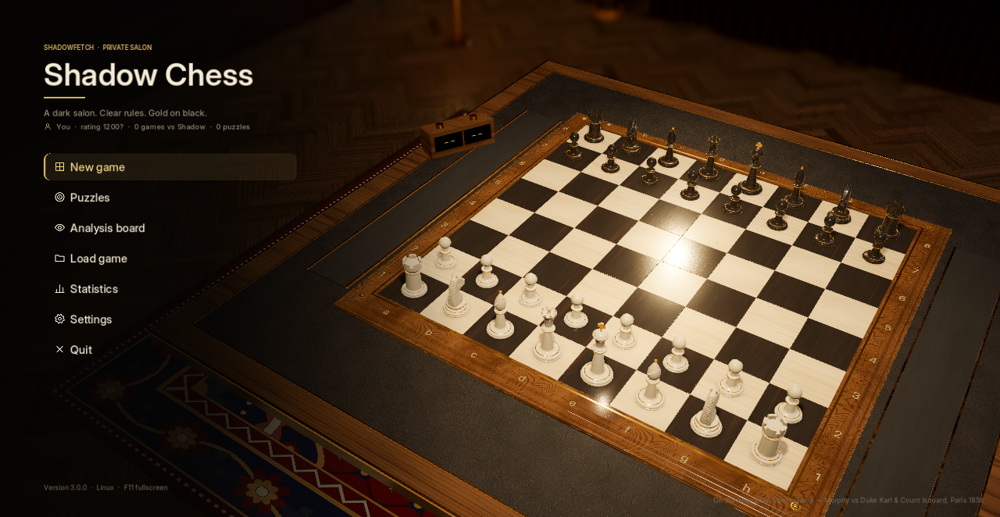
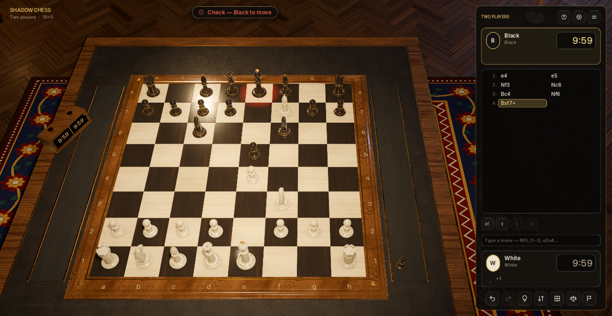
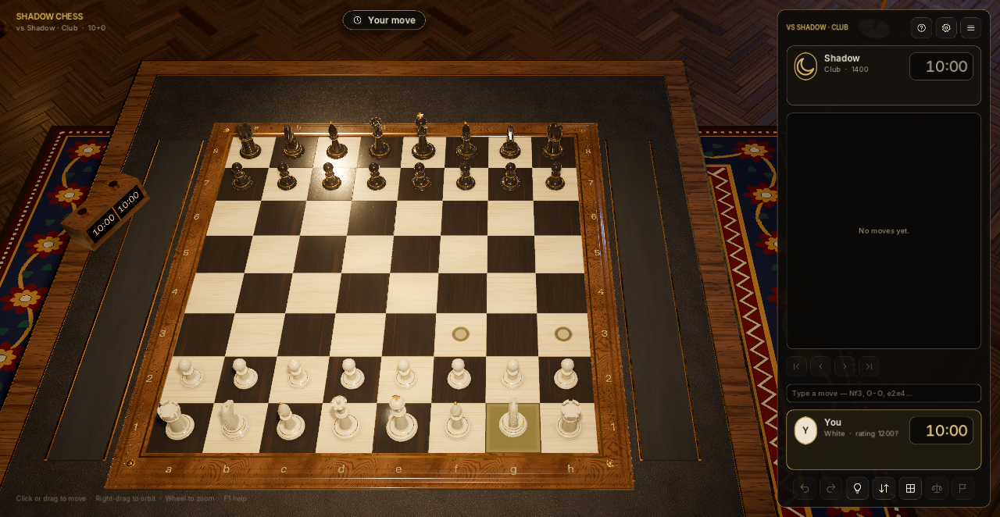
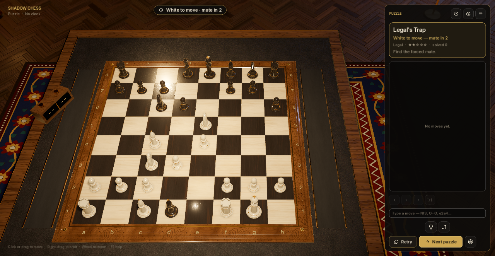
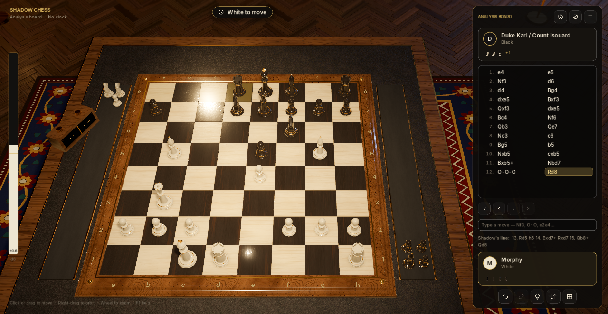
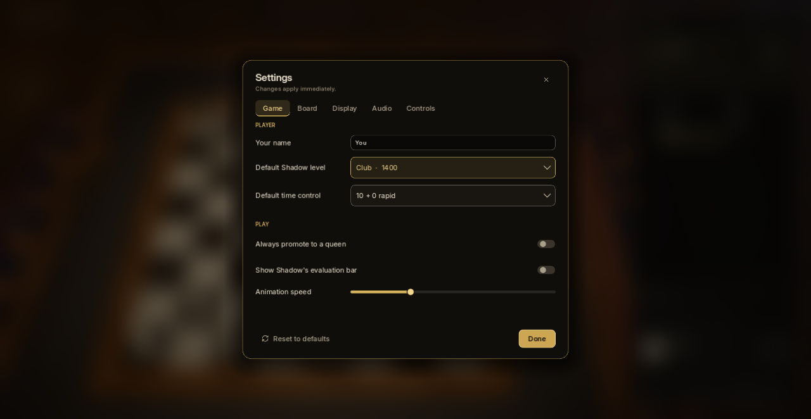

# Shadow Chess 3D

A flagship 3D chess game for Linux. Play Shadow — a threaded engine with six strengths — at a walnut table in a candle-dark private salon, solve 36 verified checkmate puzzles, or analyse your games with a live evaluation bar. Built with Godot 4.7.

**Version 3.0.0** · Linux x86_64 · MIT





## Features

**Play**
- **Shadow**, six levels from Beginner (~600) to Master (~2100), with a weighted opening book. Its search runs on a worker thread, so the board never freezes. See [docs/AI.md](docs/AI.md).
- **Two players** on one board, and an **analysis board** for free play with evaluation and Shadow's best line.
- Time controls from 1+0 bullet to 30+0 classical, with increments, low-time warnings, and a working tournament clock on the table.
- Full FIDE rules: castling, en passant, any promotion, and automatic draws by stalemate, threefold repetition, the fifty-move rule, insufficient material, and timeout against a bare king.
- Offer draws (Shadow judges them on the position), resign, rematch, or swap colours.

**Learn and review**
- **36 puzzles** — mate in 1, 2, and 3 on classic patterns. Any correct move counts; the defender resists as long as possible; progress is saved.
- **Hints** show Shadow's suggestion as an arrow.
- **Review** any game move by move from the scoresheet or with the arrow keys; the evaluation bar and Shadow's line follow along.
- Import and export **PGN** (with comments, variations, and custom start positions) and **FEN**.
- **Statistics**: your rating against Shadow, a record per level, puzzles solved, streaks.

**Feel**
- Drag-and-drop or click-to-move, legal-move marks, hover highlights, typed moves (`Nf3`, `O-O`, `e2e4`).
- Blender-built Staunton pieces with a sculpted knight, four board themes, and four piece sets.
- Pieces glide on arcs, captures land in felt trays beside the board, promotions pop, kings jolt in check.
- Original synthesised sound: wooden placements with variation, a bell for mate, and an ambient D-Dorian score.
- Autosave with **Continue**, settings that apply instantly, UI scaling, reduce-motion, and high-contrast marks.









## Install and run

```bash
./tools/export_linux.sh     # builds export/linux/shadow-chess-3d.x86_64
./tools/install-user.sh     # installs to ~/.local/bin and adds the app launcher
shadow-chess-3d
```

`./tools/install-user.sh --uninstall` removes the binary and launcher and keeps your saves. Export templates for Godot 4.7.2 must be installed under `~/.local/share/godot/export_templates/4.7.2.stable/`.

From source: `godot --path .`

## Controls

| Input | Action |
|---|---|
| Left click / drag | Select and move |
| Right drag · middle drag · wheel | Orbit · pan · zoom |
| Q / E, + / − | Orbit and zoom from the keyboard |
| C · T · F | Reset camera · top-down view · flip board |
| H | Hint |
| Ctrl+Z · Ctrl+Y | Take back · replay |
| ← → · Home End | Step through the game |
| Esc · F1 · F11 | Pause menu · help · fullscreen |

## Files

- Settings: `~/.config/shadow-chess-3d/settings.json`
- Saves, autosave, profile: `~/.local/share/shadow-chess-3d/`

Settings and saves from 2.0 are migrated automatically.

## Development

```bash
./tools/run_tests.sh                                         # all headless suites
godot --headless --path . --script res://tools/check_scripts.gd   # parse-check every script
godot --headless --path . --script res://tools/bench_ai.gd        # engine depth and speed per level
./tools/capture_screenshots.sh                               # regenerate docs/screenshots
```

The suites cover the rules engine (perft on reference positions, every special move and draw), SAN/PGN round trips, Shadow's behaviour and threading, every puzzle and book line, settings and save migration, and an end-to-end drive of the game controller.

Assets are generated by scripts in `tools/assetgen/` — models (Blender), textures, and audio. See [docs/ASSETS.md](docs/ASSETS.md).

## Documentation

- [Architecture](docs/ARCHITECTURE.md) — modules, threading, save format, rendering
- [Shadow, the engine](docs/AI.md) — search, evaluation, levels, puzzles
- [Presentation](docs/PRESENTATION.md) — scene, themes, lighting, motion
- [Assets](docs/ASSETS.md) — where every asset comes from
- [Changelog](CHANGELOG.md)

Sibling project: [Shadow Checkers](https://github.com/Shadowfetchapps/shadow-checkers).
